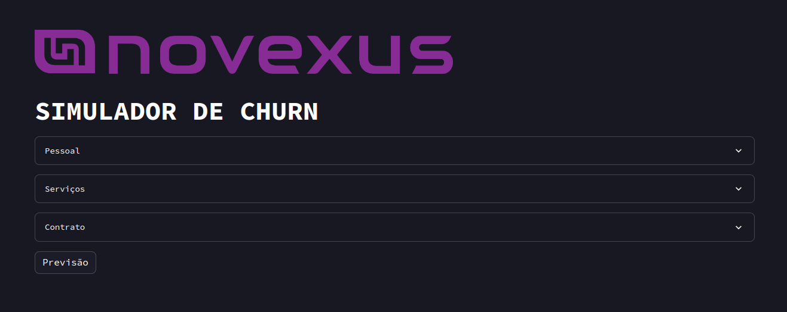
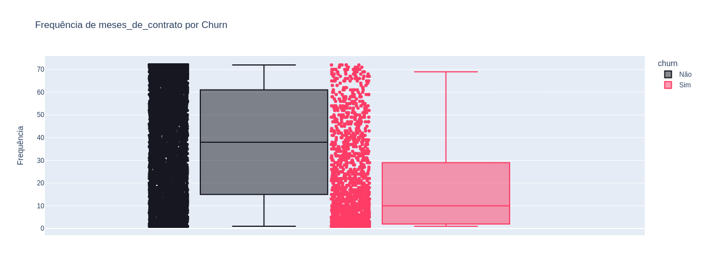
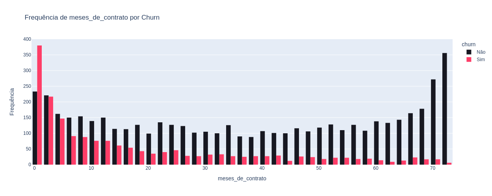
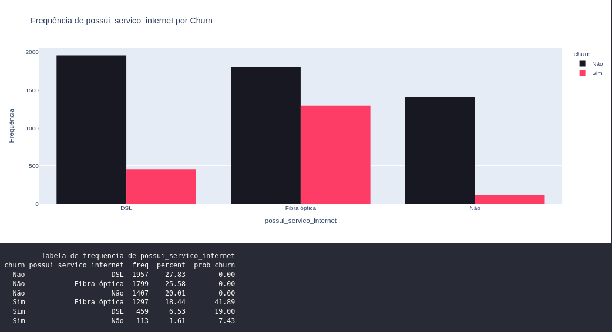
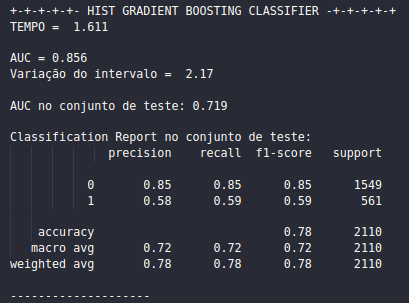
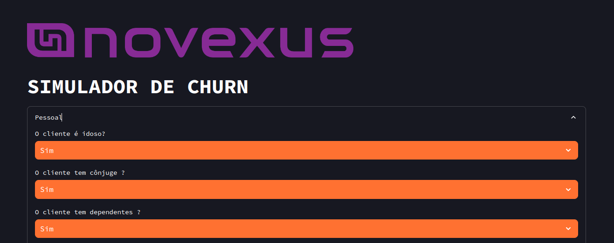
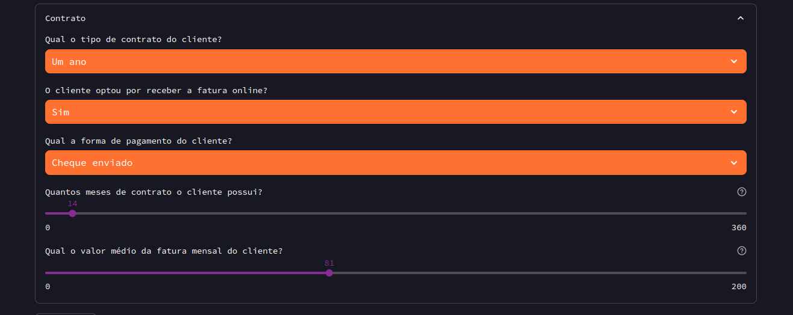
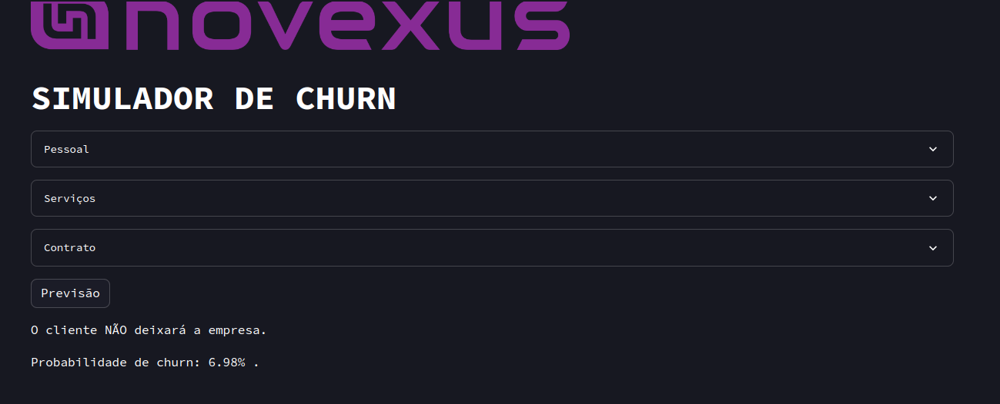

# Challenge Dados - Alura 3ª edição
# ML APP - Classificação de churn 

| :placard: Vitrine.Dev |     |
| -------------  | --- |
| :sparkles: Nome        | **ML APP - Classificação de churn **
| :label: Tecnologias | python
| :rocket: URL         | https://novexus-simulador-churn.streamlit.app/
| :fire: Desafio     | 

<!-- Inserir imagem com a #vitrinedev ao final do link -->

## Contexto
.png)

Você é a pessoa contratada como cientista de dados pela operadora de telecomunicações Novexus. Na reunião inicial com as pessoas responsáveis pela área de vendas da empresa, foi explicada a importância de reduzir a **Taxa de Evasão de Clientes**, também conhecida como **Churn Rate**.

Com base em sua experiência, você sugere como um passo inicial a identificação de clientes que teriam uma maior chance de deixar a Novexus. Por conta disso, todo o time percebe o quanto será interessante investigar algumas características de clientes ou dos planos de clientes para tentar **CLASSIFICAR** essas pessoas como potenciais candidatas a deixar a empresa ou não.

Neste desafio, você terá a oportunidade de explorar, tratar e modelar dados em busca de insights valiosos. Vamos focar na otimização e disponibilização do modelo para alcançar o melhor resultado possível na tomada de decisões estratégicas da Novexus. Além disso, temos uma tarefa especial para você: desenvolver um **APP Web** que facilite a classificação de potenciais clientes, tornando todo o processo mais ágil e eficiente.

## Semana 1 - Limpeza e análise exploratória dos dados ✅
Foram realizadas as transformações iniciais e análise exploratória dos dados. 

Conclusão EDA:
*Em síntese, a análise dos diversos atributos revela nuances importantes relacionadas ao churn.* 
*Enquanto alguns fatores, como gênero, têm pouca influência na probabilidade de churn, outros, como idade, tipo de contrato e presença de serviços específicos, demonstram impactos significativos.*
*A duração do contrato surge como um elemento crucial, com contratos de curto prazo exibindo maior probabilidade de churn, porém mesmo contratos mais longos não estão imunes a esse fenômeno.*
*Compreender essas relações permite a empresa aprimorar suas estratégias de retenção, personalizando abordagens para minimizar o churn e otimizar a satisfação do cliente.*

Amostra de gráficos realizados:

## Semana 2 - Construindo e otimizando modelos de machine learning ✅

Na segunda semana, o projeto focou na modelagem e otimização para prever o churn com precisão. Inicialmente, os dados desbalanceados foram tratados com a técnica SMOTE do Imbalanced Learning. 
Diversos modelos baseados em bagging e boosting foram testados:

Modelos sem normalização dos dados:
- RandomForestClassifier
- ExtraTreesClassifier

Modelos com normalização dos dados:
- KNeighborsClassifier e BaggingClassifier (embora o Bagging seja usado como técnica de ensemble e não exija normalização, o KNeighborsClassifier requer normalização)
- AdaBoostClassifier
- HistGradientBoostingClassifier, incluindo RandomForest, ExtraTrees, KNeighbors, Bagging, AdaBoost e Hist Gradient Boosting.

Os três melhores modelos escolhidos para otimização foram:

- RandomForest
- AdaBoost
- Hist Gradient Boosting

Dos modelos testados, o Hist Gradient Boosting Classifier se destacou como o mais promissor, demonstrando melhor desempenho em métricas críticas, como AUC e recall. O recall é fundamental em modelos de previsão de churn, pois ajuda a identificar eficazmente os clientes em risco de deixar o serviço, minimizando perdas de receita. 

Além disso, um benefício adicional foi observado: este modelo demonstrou um tempo de treinamento mais rápido em comparação com outras opções, tornando-o uma escolha eficiente em termos de tempo de treinamento.

## Semana 3 e 4 - Deploy do modelo de machine learning e portfólio ✅

Durante a terceira semana, foi concluído o processo de implantação do modelo desenvolvido. 
Utilizando a plataforma Streamlit, foi criada uma interface intuitiva. Essa interface foi projetada para permitir que um colaborador da Novexus preencha um formulário, tornando mais fácil verificar a probabilidade de um cliente estar propenso ao churn.

